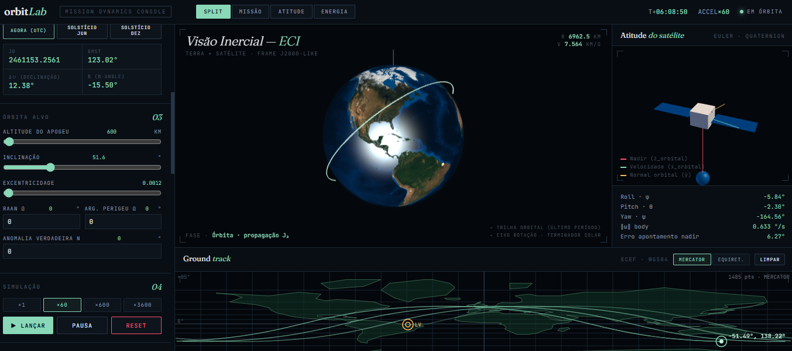

# OrbitLab

Browser-based satellite mission simulator built in vanilla JS + Three.js.

**Live demo:** https://walterCNeto.github.io/OrbitLab/

## Features

- J2-perturbed orbital propagation (RK4 integrator, WGS84 constants)
- Real solar ephemeris (Montenbruck low-precision) + GMST (Vallado IAU 1982)
- Attitude dynamics: Euler equations + gravity-gradient torque + magnetic dipole model
- Attitude control: PD nadir pointing with reaction wheels + B-dot detumble
- Power subsystem: 3 solar panel configurations (fixed ±Y, 5-face body-mounted, SADA 1-DOF)
- Battery energy balance with eclipse detection
- Interactive 3D Earth + ground track (Mercator/Equirectangular)
- Saturn V staged launch animation
- Launch site presets (Alcântara, Cape Canaveral, Kourou, Baikonur, Vandenberg, Tanegashima)

## Running locally

Just open `index.html` in a browser. No build step, no dependencies, no backend.

## Scope and limitations

This is an educational/exploratory simulator, not mission-grade software. For
real mission analysis use GMAT, STK, Orekit, or poliastro.

- Simplified J2-only gravity (no higher harmonics)
- Cylindrical eclipse shadow (no penumbra)
- UT1 ≈ UTC assumption
- No atmospheric drag, SRP, or third-body perturbations
- Kinematic launch trajectory (not thrust-integrated)

## Author

Built by Walter C. Neto as an exploration of orbital mechanics,
attitude dynamics, and spacecraft subsystems.

## License

MIT =)